# Testing Documentation

Maps every application path to the tests that cover it.

**Test types**
- **Unit** — xUnit page-model / service / API tests (`Category=Unit`) — 364 tests
- **E2E** — Playwright browser tests (`Category=E2E`)

**Coverage legend**
| Symbol | Meaning |
|---|---|
| ✅ | Unit **and** E2E coverage |
| 🟡 | Unit tests only |
| 🔵 | Constructor / instantiation test only |
| ❌ | No tests |

---

## Table of Contents

1. [Application Overview](#1-application-overview)
2. [Registration & Email Confirmation](#2-registration--email-confirmation)
3. [Authentication — Login](#3-authentication--login)
4. [Password Recovery](#4-password-recovery)
5. [Two-Factor Authentication](#5-two-factor-authentication)
6. [Passkeys (WebAuthn)](#6-passkeys-webauthn)
7. [External Login — Google OIDC](#7-external-login--google-oidc)
8. [Account Management — Profile & Phone](#8-account-management--profile--phone)
9. [Account Management — Email Change](#9-account-management--email-change)
10. [Account Management — Password](#10-account-management--password)
11. [Account Management — External Logins](#11-account-management--external-logins)
12. [Account Management — Personal Data](#12-account-management--personal-data)
13. [Minimal API — Passkey Endpoints](#13-minimal-api--passkey-endpoints)
14. [Services](#14-services)
15. [Root & Utility Pages](#15-root--utility-pages)
16. [Coverage Summary Matrix](#16-coverage-summary-matrix)

---

## 1. Application Overview

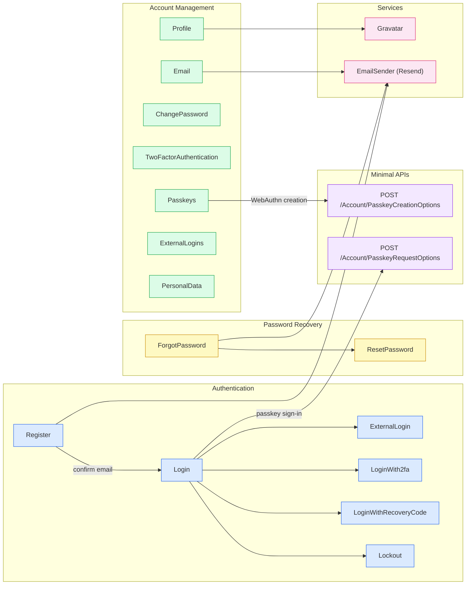

---

## 2. Registration & Email Confirmation

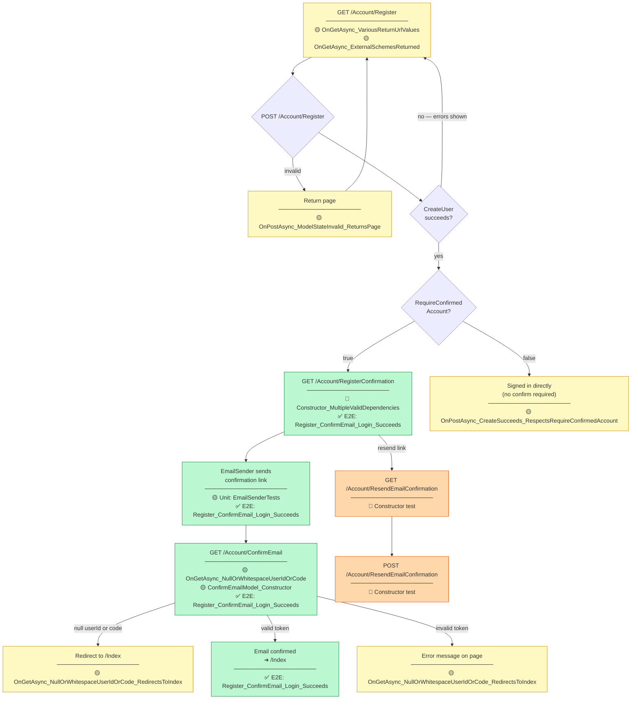

### Registration Tests

| Path | File | Test Method |
|---|---|---|
| GET /Account/Register — return URL variants | `Register.cshtmlTests.cs` | `OnGetAsync_VariousReturnUrlValues_AssignsReturnUrlAndDoesNotThrow` |
| GET /Account/Register — external scheme population | `Register.cshtmlTests.cs` | `OnGetAsync_ExternalSchemesReturned_PopulatesExternalLogins` |
| POST /Account/Register — invalid model | `Register.cshtmlTests.cs` | `OnPostAsync_ModelStateInvalid_ReturnsPage` |
| POST /Account/Register — create with RequireConfirmed | `Register.cshtmlTests.cs` | `OnPostAsync_CreateSucceeds_RespectsRequireConfirmedAccount` |
| GET /Account/ConfirmEmail — null params redirect | `ConfirmEmail.cshtmlTests.cs` | `OnGetAsync_NullOrWhitespaceUserIdOrCode_RedirectsToIndex` |
| GET /Account/ConfirmEmail — constructor | `ConfirmEmail.cshtmlTests.cs` | `ConfirmEmailModel_Constructor_UserManagerNull_DoesNotThrowAndStatusMessageIsNull` |
| Full register → confirm → login | `RegistrationTests.cs` (E2E) | `Register_ConfirmEmail_Login_Succeeds` |

---

## 3. Authentication — Login

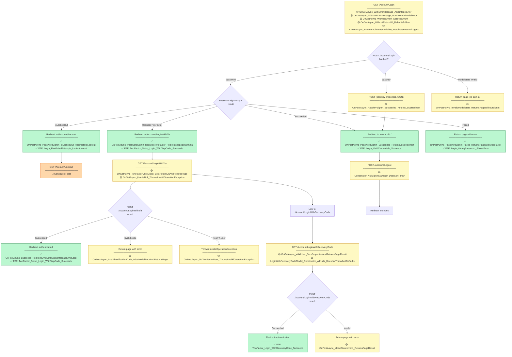

### Login Tests

| Path | File | Test Method |
|---|---|---|
| GET /Account/Login — error message | `Login.cshtmlTests.cs` | `OnGetAsync_WithErrorMessage_AddsModelError` |
| GET /Account/Login — no error | `Login.cshtmlTests.cs` | `OnGetAsync_WithoutErrorMessage_DoesNotAddModelError` |
| GET /Account/Login — return URL | `Login.cshtmlTests.cs` | `OnGetAsync_WithReturnUrl_SetsReturnUrl` |
| GET /Account/Login — default return URL | `Login.cshtmlTests.cs` | `OnGetAsync_WithoutReturnUrl_DefaultsToRoot` |
| GET /Account/Login — external schemes | `Login.cshtmlTests.cs` | `OnGetAsync_ExternalSchemesAvailable_PopulatesExternalLogins` |
| POST — password success | `Login.cshtmlTests.cs` | `OnPostAsync_PasswordSignIn_Succeeded_ReturnsLocalRedirect` |
| POST — requires 2FA | `Login.cshtmlTests.cs` | `OnPostAsync_PasswordSignIn_RequiresTwoFactor_RedirectsToLoginWith2fa` |
| POST — locked out | `Login.cshtmlTests.cs` | `OnPostAsync_PasswordSignIn_IsLockedOut_RedirectsToLockout` |
| POST — password failed | `Login.cshtmlTests.cs` | `OnPostAsync_PasswordSignIn_Failed_ReturnsPageWithModelError` |
| POST — passkey success | `Login.cshtmlTests.cs` | `OnPostAsync_PasskeySignIn_Succeeded_ReturnsLocalRedirect` |
| POST — invalid model | `Login.cshtmlTests.cs` | `OnPostAsync_InvalidModelState_ReturnsPageWithoutSignIn` |
| GET /Account/LoginWith2fa — valid state | `LoginWith2fa.cshtmlTests.cs` | `OnGetAsync_TwoFactorUserExists_SetsReturnUrlAndReturnsPage` |
| GET /Account/LoginWith2fa — null user | `LoginWith2fa.cshtmlTests.cs` | `OnGetAsync_UserIsNull_ThrowsInvalidOperationException` |
| POST /Account/LoginWith2fa — success | `LoginWith2fa.cshtmlTests.cs` | `OnPostAsync_Succeeds_RedirectsAndSetsStatusMessageAndLogs` |
| POST /Account/LoginWith2fa — invalid code | `LoginWith2fa.cshtmlTests.cs` | `OnPostAsync_InvalidVerificationCode_AddsModelErrorAndReturnsPage` |
| POST /Account/LoginWith2fa — no 2FA user | `LoginWith2fa.cshtmlTests.cs` | `OnPostAsync_NoTwoFactorUser_ThrowsInvalidOperationException` |
| GET /Account/LoginWithRecoveryCode | `LoginWithRecoveryCode.cshtmlTests.cs` | `OnGetAsync_ValidUser_SetsPropertiesAndReturnsPageResult` |
| POST /Account/LoginWithRecoveryCode — invalid | `LoginWithRecoveryCode.cshtmlTests.cs` | `OnPostAsync_ModelStateInvalid_ReturnsPageResult` |
| E2E: valid credentials | `LoginTests.cs` (E2E) | `Login_ValidCredentials_Succeeds` |
| E2E: wrong password | `LoginTests.cs` (E2E) | `Login_WrongPassword_ShowsError` |
| E2E: lockout after 5 failures | `LoginTests.cs` (E2E) | `Login_FiveFailedAttempts_LocksAccount` |
| E2E: TOTP 2FA login | `TwoFactorTests.cs` (E2E) | `TwoFactor_Setup_Login_WithTotpCode_Succeeds` |
| E2E: recovery code login | `TwoFactorTests.cs` (E2E) | `TwoFactor_Login_WithRecoveryCode_Succeeds` |

---

## 4. Password Recovery

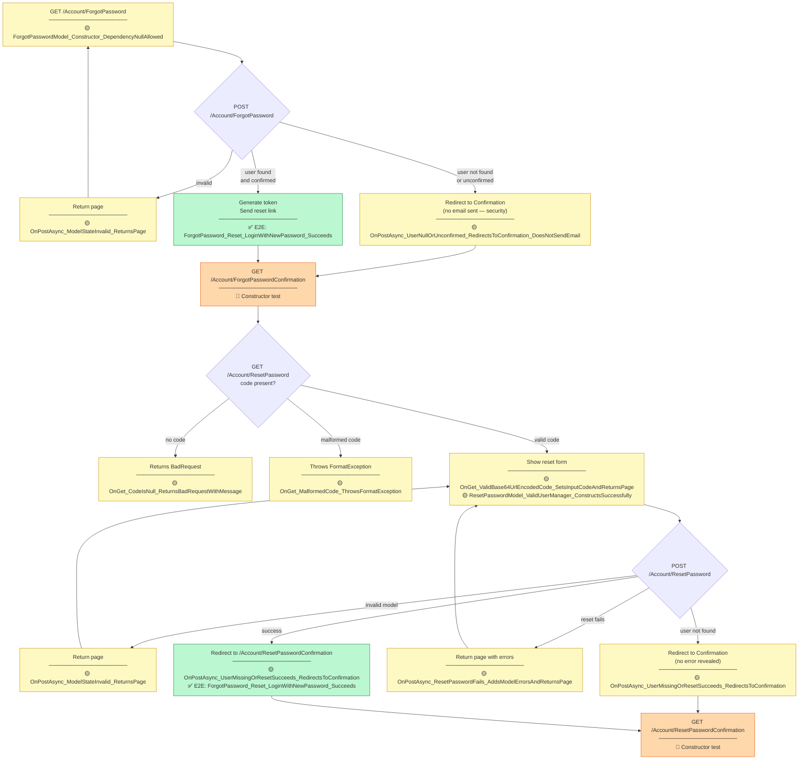

### Password Recovery Tests

| Path | File | Test Method |
|---|---|---|
| POST — invalid model | `ForgotPassword.cshtmlTests.cs` | `OnPostAsync_ModelStateInvalid_ReturnsPage` |
| POST — user null or unconfirmed | `ForgotPassword.cshtmlTests.cs` | `OnPostAsync_UserNullOrUnconfirmed_RedirectsToConfirmation_DoesNotSendEmail` |
| GET /ResetPassword — no code | `ResetPassword.cshtmlTests.cs` | `OnGet_CodeIsNull_ReturnsBadRequestWithMessage` |
| GET /ResetPassword — malformed code | `ResetPassword.cshtmlTests.cs` | `OnGet_MalformedCode_ThrowsFormatException` |
| GET /ResetPassword — valid code | `ResetPassword.cshtmlTests.cs` | `OnGet_ValidBase64UrlEncodedCode_SetsInputCodeAndReturnsPage` |
| POST /ResetPassword — invalid model | `ResetPassword.cshtmlTests.cs` | `OnPostAsync_ModelStateInvalid_ReturnsPage` |
| POST /ResetPassword — reset fails | `ResetPassword.cshtmlTests.cs` | `OnPostAsync_ResetPasswordFails_AddsModelErrorsAndReturnsPage` |
| POST /ResetPassword — user missing or success | `ResetPassword.cshtmlTests.cs` | `OnPostAsync_UserMissingOrResetSucceeds_RedirectsToConfirmation` |
| E2E: full forgot/reset flow | `PasswordResetTests.cs` (E2E) | `ForgotPassword_Reset_LoginWithNewPassword_Succeeds` |

---

## 5. Two-Factor Authentication

```mermaid
flowchart TD
    classDef covered fill:#bbf7d0,stroke:#15803d
    classDef unitOnly fill:#fef9c3,stroke:#ca8a04
    classDef partial fill:#fed7aa,stroke:#ea580c

    TwoFAPage["GET /Account/Manage/TwoFactorAuthentication\n────────────────────\n🟡 OnGetAsync_UserFound_SetsPropertiesAndReturnsPageResult\n🟡 OnGetAsync_UserNotFound_ReturnsNotFoundObjectResult"]:::unitOnly

    EnableAuthGET{"GET /Account/Manage/EnableAuthenticator\nuser found?"}

    EnableNotFound["NotFoundObjectResult\n────────────────────\n🟡 OnGetAsync_UserNotFound_ReturnsNotFoundWithMessage"]:::unitOnly

    EnableForm["Show QR code + shared key\n────────────────────\n🟡 Constructor_WithValidDependencies_CreatesInstance\n✅ E2E: TwoFactor_Setup_Login_WithTotpCode_Succeeds"]:::covered

    EnablePOST{"POST /Account/Manage/EnableAuthenticator"}

    EnableUserNotFound["NotFoundObjectResult\n────────────────────\n🟡 OnPostAsync_UserNotFound_ReturnsNotFoundObjectResult"]:::unitOnly

    EnableInvalid["Return page with error\n────────────────────\n🟡 OnPostAsync_InvalidVerificationCode_AddsModelErrorAndReturnsPage"]:::unitOnly

    EnableSuccess["Redirect to ShowRecoveryCodes\n(or TwoFactorAuthentication if no codes)\n────────────────────\n🟡 OnPostAsync_ValidToken_RedirectsBasedOnRecoveryCodesCount\n✅ E2E: TwoFactor_Setup_Login_WithTotpCode_Succeeds"]:::covered

    ShowCodes{"GET /Account/Manage/ShowRecoveryCodes\ncodes present?"}

    ShowCodesEmpty["Redirect to /Account/Manage/TwoFactorAuthentication\n────────────────────\n🟡 OnGet_RecoveryCodesNullOrEmpty_RedirectsToTwoFactorAuthentication"]:::unitOnly

    ShowCodesPage["Display recovery codes\n────────────────────\n🟡 OnGet_RecoveryCodesHasItems_ReturnsPageResult\n✅ E2E: TwoFactor_Setup_Login_WithTotpCode_Succeeds"]:::covered

    GenCodesGET{"GET /Account/Manage/GenerateRecoveryCodes\nstate check"}

    GenCodesNotFound["NotFoundObjectResult\n────────────────────\n🟡 OnGetAsync_UserNotFound_ReturnsNotFoundWithUserIdMessage"]:::unitOnly

    Gen2faDisabled["Throws InvalidOperationException\n────────────────────\n🟡 OnPostAsync_TwoFactorDisabled_ThrowsInvalidOperationException"]:::unitOnly

    GenCodesPOST["POST — generate new codes\n────────────────────\n🟡 OnPostAsync_TwoFactorEnabled_GeneratesCodesAndRedirects\n✅ E2E: TwoFactor_Login_WithRecoveryCode_Succeeds"]:::covered

    Disable2faGET{"GET /Account/Manage/Disable2fa\nstate check"}

    DisableNotFound["NotFoundObjectResult\n────────────────────\n🟡 OnGet_UserIsNull_ReturnsNotFoundWithUserIdInMessage"]:::unitOnly

    Disable2faNotEnabled["Throws InvalidOperationException\n────────────────────\n🟡 OnGet_TwoFactorState_BehavesAsExpected"]:::unitOnly

    Disable2faForm["Show confirmation form\n────────────────────\n🟡 OnGet_TwoFactorState_BehavesAsExpected"]:::unitOnly

    Disable2faPOST{"POST /Account/Manage/Disable2fa"}

    DisableFails["Throws InvalidOperationException\n────────────────────\n🟡 OnPostAsync_DisableFails_ThrowsInvalidOperationException"]:::unitOnly

    DisableSuccess["Redirect to /Account/Manage/TwoFactorAuthentication\n────────────────────\n🟡 OnPostAsync_Succeeds_RedirectsAndSetsStatusMessageAndLogs"]:::unitOnly

    ResetAuthGET["GET /Account/Manage/ResetAuthenticator\n────────────────────\n🟡 OnGet_UserExistence_ReturnsExpectedResult\n🟡 ResetAuthenticatorModel_Constructor_WithValidDependencies_DoesNotThrow"]:::unitOnly

    ResetAuthPOST["POST — reset authenticator\n────────────────────\n🟡 OnPostAsync_UserExists_ResetsAndRedirectsRegardlessOfIdentityResult\n🟡 OnPostAsync_UserNotFound_ReturnsNotFoundWithExpectedMessage"]:::unitOnly

    TwoFAPage -->|"setup TOTP"| EnableAuthGET
    TwoFAPage -->|"generate new codes"| GenCodesGET
    TwoFAPage -->|"disable 2FA"| Disable2faGET
    TwoFAPage -->|"reset authenticator"| ResetAuthGET
    EnableAuthGET -->|"not found"| EnableNotFound
    EnableAuthGET -->|"found"| EnableForm
    EnableForm --> EnablePOST
    EnablePOST -->|"user not found"| EnableUserNotFound
    EnablePOST -->|"invalid code"| EnableInvalid
    EnableInvalid --> EnableForm
    EnablePOST -->|"valid code"| EnableSuccess
    EnableSuccess --> ShowCodes
    ShowCodes -->|"empty"| ShowCodesEmpty
    ShowCodesEmpty --> TwoFAPage
    ShowCodes -->|"has codes"| ShowCodesPage
    GenCodesGET -->|"not found"| GenCodesNotFound
    GenCodesGET -->|"2FA disabled"| Gen2faDisabled
    GenCodesGET -->|"2FA enabled"| GenCodesPOST
    GenCodesPOST --> ShowCodes
    Disable2faGET -->|"user not found"| DisableNotFound
    Disable2faGET -->|"2FA not enabled"| Disable2faNotEnabled
    Disable2faGET -->|"2FA enabled"| Disable2faForm
    Disable2faForm --> Disable2faPOST
    Disable2faPOST -->|"fails"| DisableFails
    Disable2faPOST -->|"success"| DisableSuccess
    DisableSuccess --> TwoFAPage
    ResetAuthGET --> ResetAuthPOST
    ResetAuthPOST --> TwoFAPage
```

### 2FA Tests

| Path | File | Test Method |
|---|---|---|
| GET /TwoFactorAuthentication — user found | `TwoFactorAuthentication.cshtmlTests.cs` | `OnGetAsync_UserFound_SetsPropertiesAndReturnsPageResult` |
| GET /TwoFactorAuthentication — user not found | `TwoFactorAuthentication.cshtmlTests.cs` | `OnGetAsync_UserNotFound_ReturnsNotFoundObjectResult` |
| GET /EnableAuthenticator — user not found | `EnableAuthenticator.cshtmlTests.cs` | `OnGetAsync_UserNotFound_ReturnsNotFoundWithMessage` |
| POST /EnableAuthenticator — user not found | `EnableAuthenticator.cshtmlTests.cs` | `OnPostAsync_UserNotFound_ReturnsNotFoundObjectResult` |
| POST /EnableAuthenticator — invalid code | `EnableAuthenticator.cshtmlTests.cs` | `OnPostAsync_InvalidVerificationCode_AddsModelErrorAndReturnsPage` |
| POST /EnableAuthenticator — valid, redirect | `EnableAuthenticator.cshtmlTests.cs` | `OnPostAsync_ValidToken_RedirectsBasedOnRecoveryCodesCount` |
| GET /ShowRecoveryCodes — empty | `ShowRecoveryCodes.cshtmlTests.cs` | `OnGet_RecoveryCodesNullOrEmpty_RedirectsToTwoFactorAuthentication` |
| GET /ShowRecoveryCodes — has codes | `ShowRecoveryCodes.cshtmlTests.cs` | `OnGet_RecoveryCodesHasItems_ReturnsPageResult` |
| GET /GenerateRecoveryCodes — user not found | `GenerateRecoveryCodes.cshtmlTests.cs` | `OnGetAsync_UserNotFound_ReturnsNotFoundWithUserIdMessage` |
| POST /GenerateRecoveryCodes — 2FA disabled | `GenerateRecoveryCodes.cshtmlTests.cs` | `OnPostAsync_TwoFactorDisabled_ThrowsInvalidOperationException` |
| POST /GenerateRecoveryCodes — generate | `GenerateRecoveryCodes.cshtmlTests.cs` | `OnPostAsync_TwoFactorEnabled_GeneratesCodesAndRedirects` |
| GET /Disable2fa — state check | `Disable2fa.cshtmlTests.cs` | `OnGet_TwoFactorState_BehavesAsExpected` |
| GET /Disable2fa — user null | `Disable2fa.cshtmlTests.cs` | `OnGet_UserIsNull_ReturnsNotFoundWithUserIdInMessage` |
| POST /Disable2fa — fails | `Disable2fa.cshtmlTests.cs` | `OnPostAsync_DisableFails_ThrowsInvalidOperationException` |
| POST /Disable2fa — success | `Disable2fa.cshtmlTests.cs` | `OnPostAsync_Succeeds_RedirectsAndSetsStatusMessageAndLogs` |
| GET /ResetAuthenticator — user existence | `ResetAuthenticator.cshtmlTests.cs` | `OnGet_UserExistence_ReturnsExpectedResult` |
| POST /ResetAuthenticator | `ResetAuthenticator.cshtmlTests.cs` | `OnPostAsync_UserExists_ResetsAndRedirectsRegardlessOfIdentityResult` |
| POST /ResetAuthenticator — user not found | `ResetAuthenticator.cshtmlTests.cs` | `OnPostAsync_UserNotFound_ReturnsNotFoundWithExpectedMessage` |
| E2E: TOTP setup + login | `TwoFactorTests.cs` (E2E) | `TwoFactor_Setup_Login_WithTotpCode_Succeeds` |
| E2E: recovery code login | `TwoFactorTests.cs` (E2E) | `TwoFactor_Login_WithRecoveryCode_Succeeds` |

---

## 6. Passkeys (WebAuthn)

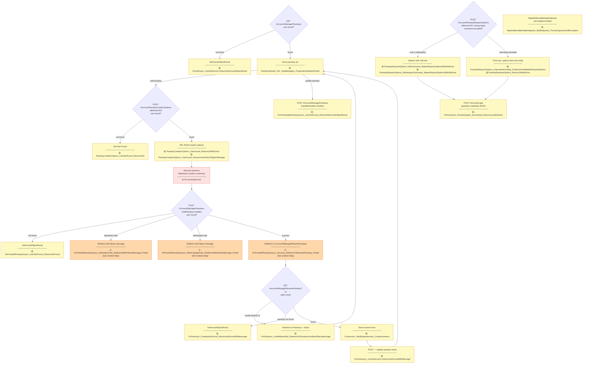

### Passkey Tests

| Path | File | Test Method |
|---|---|---|
| `MapAdditionalIdentityEndpoints` null guard | `PasskeyEndpointRouteBuilderExtensionsTests.cs` | `MapAdditionalIdentityEndpoints_NullEndpoints_ThrowsArgumentNullException` |
| POST /PasskeyCreationOptions — user not found | `PasskeyEndpointRouteBuilderExtensionsTests.cs` | `PasskeyCreationOptions_UserNotFound_Returns404` |
| POST /PasskeyCreationOptions — 200 + JSON | `PasskeyEndpointRouteBuilderExtensionsTests.cs` | `PasskeyCreationOptions_UserFound_ReturnsOkWithJson` |
| POST /PasskeyCreationOptions — user entity | `PasskeyEndpointRouteBuilderExtensionsTests.cs` | `PasskeyCreationOptions_UserFound_PassesUserEntityToSignInManager` |
| POST /PasskeyRequestOptions — null username | `PasskeyEndpointRouteBuilderExtensionsTests.cs` | `PasskeyRequestOptions_NullUsername_MakesRequestOptionsWithNullUser` |
| POST /PasskeyRequestOptions — whitespace | `PasskeyEndpointRouteBuilderExtensionsTests.cs` | `PasskeyRequestOptions_WhitespaceUsername_MakesRequestOptionsWithNullUser` |
| POST /PasskeyRequestOptions — with username | `PasskeyEndpointRouteBuilderExtensionsTests.cs` | `PasskeyRequestOptions_UsernameProvided_FindsUserAndMakesRequestOptions` |
| POST /PasskeyRequestOptions — 200 | `PasskeyEndpointRouteBuilderExtensionsTests.cs` | `PasskeyRequestOptions_ReturnsOkWithJson` |
| GET /Manage/Passkeys — not found | `Passkeys.cshtmlTests.cs` | `OnGetAsync_UserNotFound_ReturnsNotFoundObjectResult` |
| GET /Manage/Passkeys — constructor | `Passkeys.cshtmlTests.cs` | `PasskeysModel_Ctor_ValidManagers_PropertiesInitializedToNull` |
| AddPasskey — user not found | `Passkeys.cshtmlTests.cs` | `OnPostAddPasskeyAsync_UserNotFound_ReturnsNotFound` |
| AddPasskey — attestation fails (skipped) | `Passkeys.cshtmlTests.cs` | `OnPostAddPasskeyAsync_AttestationFails_RedirectsWithFailureMessage_Partial` |
| AddPasskey — add/update fails (skipped) | `Passkeys.cshtmlTests.cs` | `OnPostAddPasskeyAsync_AddOrUpdateFails_RedirectsWithFailureMessage_Partial` |
| AddPasskey — success (skipped) | `Passkeys.cshtmlTests.cs` | `OnPostAddPasskeyAsync_Success_RedirectsToRenamePasskey_Partial` |
| UpdatePasskey — user not found | `Passkeys.cshtmlTests.cs` | `OnPostUpdatePasskeyAsync_UserNotFound_ReturnsNotFoundObjectResult` |
| GET /RenamePasskey — invalid base64 | `RenamePasskey.cshtmlTests.cs` | `OnGetAsync_InvalidBase64Id_RedirectsToPasskeysAndSetsStatusMessage` |
| GET /RenamePasskey — not found | `RenamePasskey.cshtmlTests.cs` | `OnGetAsync_PasskeyNotFound_ReturnsNotFoundWithMessage` |
| POST /RenamePasskey — user not found | `RenamePasskey.cshtmlTests.cs` | `OnPostAsync_UserNotFound_ReturnsNotFoundWithMessage` |

> **Note:** The WebAuthn browser ceremony (navigator.credentials.create/get) has no automated test coverage; the three skip-marked tests represent intended future coverage.

---

## 7. External Login — Google OIDC

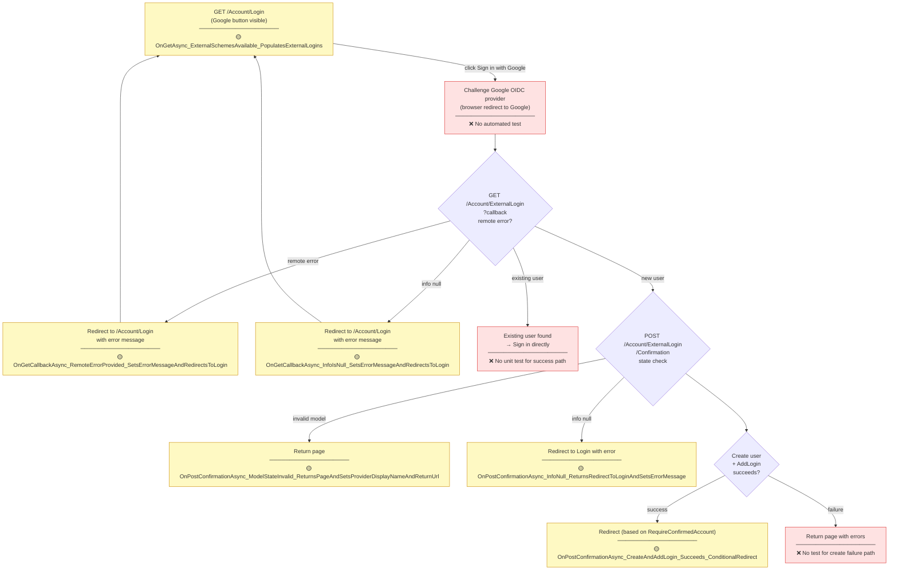

### External Login Tests

| Path | File | Test Method |
|---|---|---|
| GET /Login — external schemes | `Login.cshtmlTests.cs` | `OnGetAsync_ExternalSchemesAvailable_PopulatesExternalLogins` |
| Callback — remote error | `ExternalLogin.cshtmlTests.cs` | `OnGetCallbackAsync_RemoteErrorProvided_SetsErrorMessageAndRedirectsToLogin` |
| Callback — info null | `ExternalLogin.cshtmlTests.cs` | `OnGetCallbackAsync_InfoIsNull_SetsErrorMessageAndRedirectsToLogin` |
| Confirmation — model invalid | `ExternalLogin.cshtmlTests.cs` | `OnPostConfirmationAsync_ModelStateInvalid_ReturnsPageAndSetsProviderDisplayNameAndReturnUrl` |
| Confirmation — info null | `ExternalLogin.cshtmlTests.cs` | `OnPostConfirmationAsync_InfoNull_ReturnsRedirectToLoginAndSetsErrorMessage` |
| Confirmation — create + add login | `ExternalLogin.cshtmlTests.cs` | `OnPostConfirmationAsync_CreateAndAddLogin_Succeeds_ConditionalRedirect` |

> **Note:** The Google OAuth redirect and the existing-user sign-in path have no automated test coverage (requires live Google OIDC).

---

## 8. Account Management — Profile & Phone

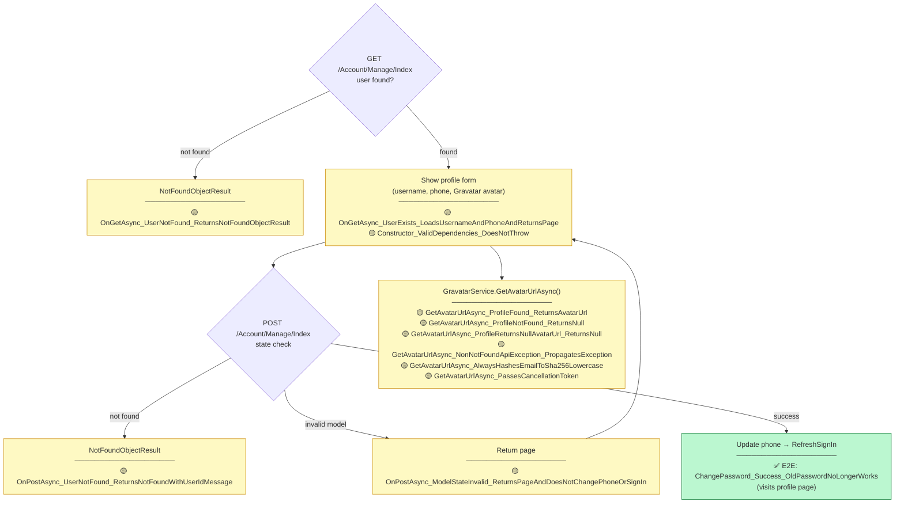

### Profile Tests

| Path | File | Test Method |
|---|---|---|
| GET — user not found | `Manage/Index.cshtmlTests.cs` | `OnGetAsync_UserNotFound_ReturnsNotFoundObjectResult` |
| GET — user found | `Manage/Index.cshtmlTests.cs` | `OnGetAsync_UserExists_LoadsUsernameAndPhoneAndReturnsPage` |
| POST — user not found | `Manage/Index.cshtmlTests.cs` | `OnPostAsync_UserNotFound_ReturnsNotFoundWithUserIdMessage` |
| POST — invalid model | `Manage/Index.cshtmlTests.cs` | `OnPostAsync_ModelStateInvalid_ReturnsPageAndDoesNotChangePhoneOrSignIn` |
| Gravatar — profile found | `GravatarServiceTests.cs` | `GetAvatarUrlAsync_ProfileFound_ReturnsAvatarUrl` |
| Gravatar — not found | `GravatarServiceTests.cs` | `GetAvatarUrlAsync_ProfileNotFound_ReturnsNull` |
| Gravatar — null avatar URL | `GravatarServiceTests.cs` | `GetAvatarUrlAsync_ProfileReturnsNullAvatarUrl_ReturnsNull` |
| Gravatar — non-404 exception | `GravatarServiceTests.cs` | `GetAvatarUrlAsync_NonNotFoundApiException_PropagatesException` |
| Gravatar — SHA-256 hash casing | `GravatarServiceTests.cs` | `GetAvatarUrlAsync_AlwaysHashesEmailToSha256Lowercase` |
| Gravatar — cancellation | `GravatarServiceTests.cs` | `GetAvatarUrlAsync_PassesCancellationToken` |

---

## 9. Account Management — Email Change

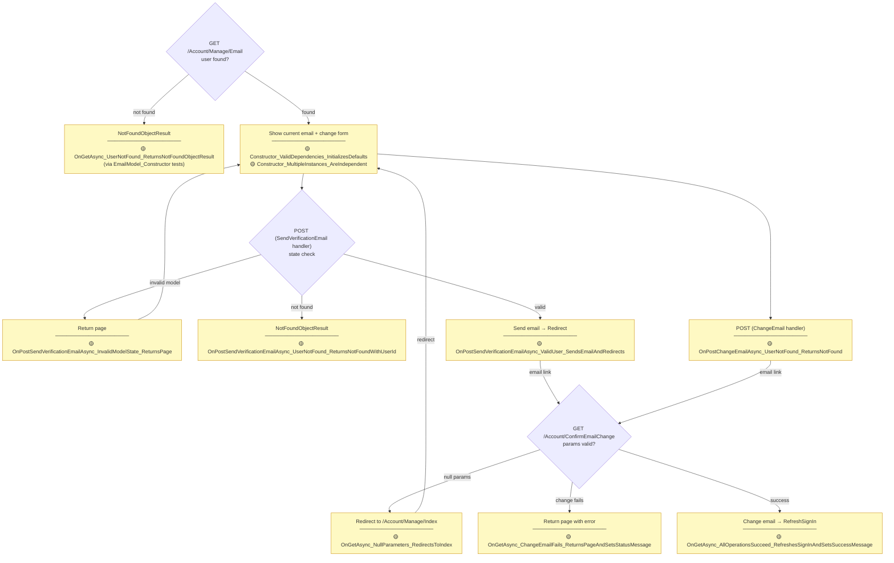

### Email Change Tests

| Path | File | Test Method |
|---|---|---|
| GET — constructor defaults | `Manage/Email.cshtmlTests.cs` | `Constructor_ValidDependencies_InitializesDefaults` |
| POST SendVerification — invalid model | `Manage/Email.cshtmlTests.cs` | `OnPostSendVerificationEmailAsync_InvalidModelState_ReturnsPage` |
| POST SendVerification — user not found | `Manage/Email.cshtmlTests.cs` | `OnPostSendVerificationEmailAsync_UserNotFound_ReturnsNotFoundWithUserId` |
| POST SendVerification — success | `Manage/Email.cshtmlTests.cs` | `OnPostSendVerificationEmailAsync_ValidUser_SendsEmailAndRedirects` |
| POST ChangeEmail — user not found | `Manage/Email.cshtmlTests.cs` | `OnPostChangeEmailAsync_UserNotFound_ReturnsNotFound` |
| GET /ConfirmEmailChange — null params | `ConfirmEmailChange.cshtmlTests.cs` | `OnGetAsync_NullParameters_RedirectsToIndex` |
| GET /ConfirmEmailChange — special char email | `ConfirmEmailChange.cshtmlTests.cs` | `OnGetAsync_SpecialCharacterEmail_ProceedsAndReturnSuccess` |
| GET /ConfirmEmailChange — empty email | `ConfirmEmailChange.cshtmlTests.cs` | `OnGetAsync_EmptyOrWhitespaceEmail_RedirectsToIndex` |
| GET /ConfirmEmailChange — change fails | `ConfirmEmailChange.cshtmlTests.cs` | `OnGetAsync_ChangeEmailFails_ReturnsPageAndSetsStatusMessage` |
| GET /ConfirmEmailChange — set username fails | `ConfirmEmailChange.cshtmlTests.cs` | `OnGetAsync_SetUserNameFails_ReturnsPageAndSetsStatusMessage` |
| GET /ConfirmEmailChange — success | `ConfirmEmailChange.cshtmlTests.cs` | `OnGetAsync_AllOperationsSucceed_RefreshesSignInAndSetsSuccessMessage` |

---

## 10. Account Management — Password

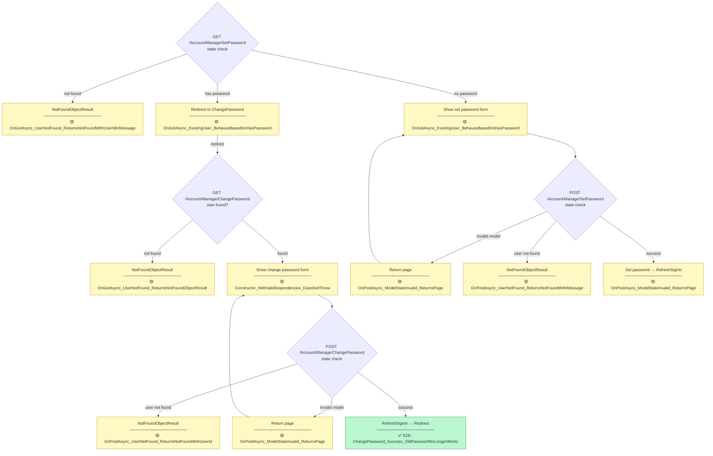

### Password Management Tests

| Path | File | Test Method |
|---|---|---|
| GET /ChangePassword — user not found | `Manage/ChangePassword.cshtmlTests.cs` | `OnGetAsync_UserNotFound_ReturnsNotFoundObjectResult` |
| POST /ChangePassword — invalid model | `Manage/ChangePassword.cshtmlTests.cs` | `OnPostAsync_ModelStateInvalid_ReturnsPage` |
| POST /ChangePassword — user not found | `Manage/ChangePassword.cshtmlTests.cs` | `OnPostAsync_UserNotFound_ReturnsNotFoundWithUserId` |
| GET /SetPassword — user not found | `Manage/SetPassword.cshtmlTests.cs` | `OnGetAsync_UserNotFound_ReturnsNotFoundWithUserIdInMessage` |
| GET /SetPassword — hasPassword check | `Manage/SetPassword.cshtmlTests.cs` | `OnGetAsync_ExistingUser_BehavesBasedOnHasPassword` |
| POST /SetPassword — invalid model | `Manage/SetPassword.cshtmlTests.cs` | `OnPostAsync_ModelStateInvalid_ReturnsPage` |
| POST /SetPassword — user not found | `Manage/SetPassword.cshtmlTests.cs` | `OnPostAsync_UserNotFound_ReturnsNotFoundWithMessage` |
| E2E: change password, old no longer works | `AccountManagementTests.cs` (E2E) | `ChangePassword_Success_OldPasswordNoLongerWorks` |

---

## 11. Account Management — External Logins

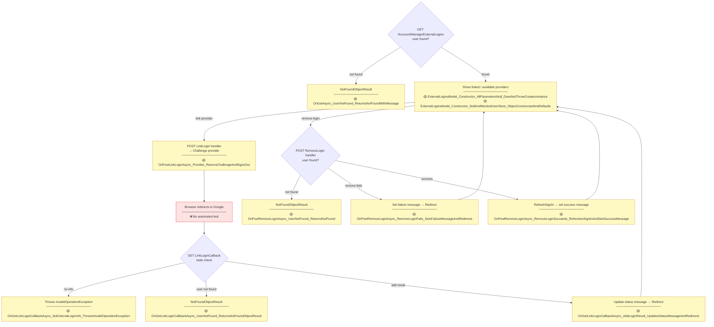

### External Logins Management Tests

| Path | File | Test Method |
|---|---|---|
| GET — user not found | `Manage/ExternalLogins.cshtmlTests.cs` | `OnGetAsync_UserNotFound_ReturnsNotFoundWithMessage` |
| POST LinkLogin — challenge | `Manage/ExternalLogins.cshtmlTests.cs` | `OnPostLinkLoginAsync_Provider_ReturnsChallengeAndSignsOut` |
| GET Callback — no info | `Manage/ExternalLogins.cshtmlTests.cs` | `OnGetLinkLoginCallbackAsync_NoExternalLoginInfo_ThrowsInvalidOperationException` |
| GET Callback — user not found | `Manage/ExternalLogins.cshtmlTests.cs` | `OnGetLinkLoginCallbackAsync_UserNotFound_ReturnsNotFoundObjectResult` |
| GET Callback — add login result | `Manage/ExternalLogins.cshtmlTests.cs` | `OnGetLinkLoginCallbackAsync_AddLoginResult_UpdatesStatusMessageAndRedirects` |
| POST RemoveLogin — user not found | `Manage/ExternalLogins.cshtmlTests.cs` | `OnPostRemoveLoginAsync_UserNotFound_ReturnsNotFound` |
| POST RemoveLogin — fails | `Manage/ExternalLogins.cshtmlTests.cs` | `OnPostRemoveLoginAsync_RemoveLoginFails_SetsFailureMessageAndRedirects` |
| POST RemoveLogin — success | `Manage/ExternalLogins.cshtmlTests.cs` | `OnPostRemoveLoginAsync_RemoveLoginSucceeds_RefreshesSignInAndSetsSuccessMessage` |

---

## 12. Account Management — Personal Data

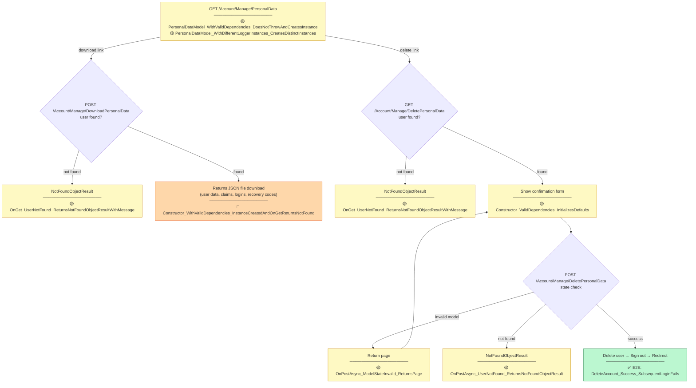

### Personal Data Tests

| Path | File | Test Method |
|---|---|---|
| GET /PersonalData — constructor | `Manage/PersonalData.cshtmlTests.cs` | `PersonalDataModel_WithValidDependencies_DoesNotThrowAndCreatesInstance` |
| GET /PersonalData — multiple instances | `Manage/PersonalData.cshtmlTests.cs` | `PersonalDataModel_WithDifferentLoggerInstances_CreatesDistinctInstances` |
| POST /DownloadPersonalData — not found | `Manage/DownloadPersonalData.cshtmlTests.cs` | `OnGet_UserNotFound_ReturnsNotFoundObjectResultWithMessage` |
| GET /DeletePersonalData — not found | `Manage/DeletePersonalData.cshtmlTests.cs` | `OnGet_UserNotFound_ReturnsNotFoundObjectResultWithMessage` |
| POST /DeletePersonalData — invalid model | `Manage/DeletePersonalData.cshtmlTests.cs` | `OnPostAsync_ModelStateInvalid_ReturnsPage` |
| POST /DeletePersonalData — not found | `Manage/DeletePersonalData.cshtmlTests.cs` | `OnPostAsync_UserNotFound_ReturnsNotFoundObjectResult` |
| E2E: delete account, login fails | `AccountManagementTests.cs` (E2E) | `DeleteAccount_Success_SubsequentLoginFails` |

---

## 13. Minimal API — Passkey Endpoints

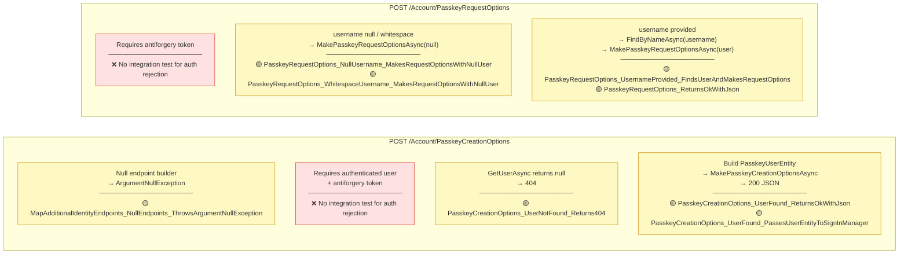

---

## 14. Services

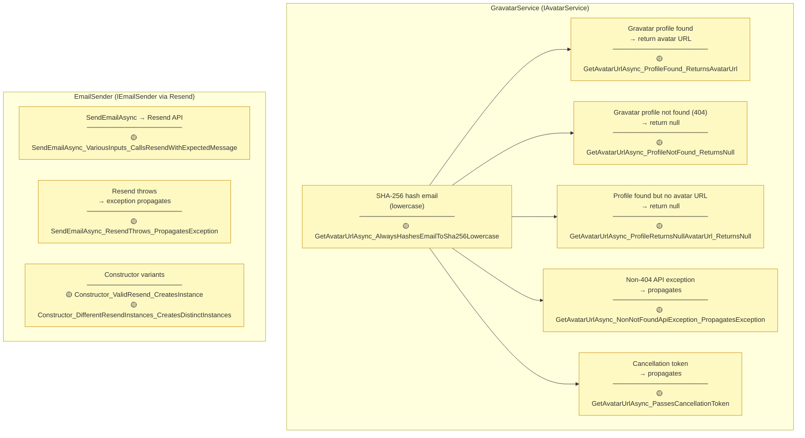

### Service Tests

| Scenario | File | Test Method |
|---|---|---|
| Gravatar — profile found | `GravatarServiceTests.cs` | `GetAvatarUrlAsync_ProfileFound_ReturnsAvatarUrl` |
| Gravatar — profile not found | `GravatarServiceTests.cs` | `GetAvatarUrlAsync_ProfileNotFound_ReturnsNull` |
| Gravatar — null avatar URL | `GravatarServiceTests.cs` | `GetAvatarUrlAsync_ProfileReturnsNullAvatarUrl_ReturnsNull` |
| Gravatar — non-404 exception | `GravatarServiceTests.cs` | `GetAvatarUrlAsync_NonNotFoundApiException_PropagatesException` |
| Gravatar — SHA-256 hash casing | `GravatarServiceTests.cs` | `GetAvatarUrlAsync_AlwaysHashesEmailToSha256Lowercase` |
| Gravatar — cancellation token | `GravatarServiceTests.cs` | `GetAvatarUrlAsync_PassesCancellationToken` |
| EmailSender — sends via Resend | `EmailSenderTests.cs` | `SendEmailAsync_VariousInputs_CallsResendWithExpectedMessage` |
| EmailSender — Resend throws | `EmailSenderTests.cs` | `SendEmailAsync_ResendThrows_PropagatesException` |
| EmailSender — constructor | `EmailSenderTests.cs` | `Constructor_ValidResend_CreatesInstance` |

---

## 15. Root & Utility Pages

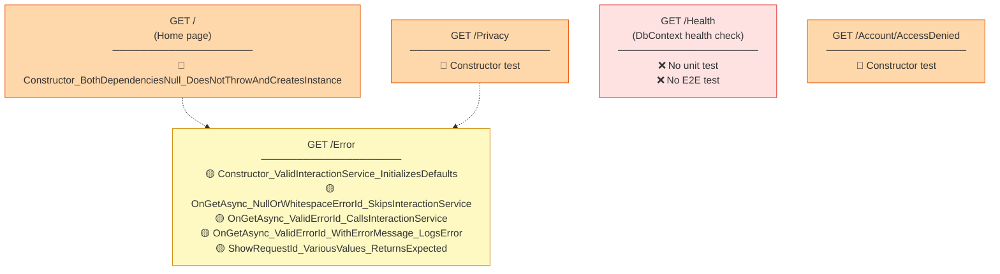

### Root & Utility Tests

| Path | File | Test Method |
|---|---|---|
| GET / — constructor | `Pages/Index.cshtmlTests.cs` | `Constructor_BothDependenciesNull_DoesNotThrowAndCreatesInstance` |
| GET /Error — no error ID | `Pages/Error.cshtmlTests.cs` | `OnGetAsync_NullOrWhitespaceErrorId_SkipsInteractionService` |
| GET /Error — with error ID | `Pages/Error.cshtmlTests.cs` | `OnGetAsync_ValidErrorId_CallsInteractionService` |
| GET /Error — with error message (logs) | `Pages/Error.cshtmlTests.cs` | `OnGetAsync_ValidErrorId_WithErrorMessage_LogsError` |
| GET /Error — ShowRequestId property | `Pages/Error.cshtmlTests.cs` | `ShowRequestId_VariousValues_ReturnsExpected` |

---

## 16. Coverage Summary Matrix

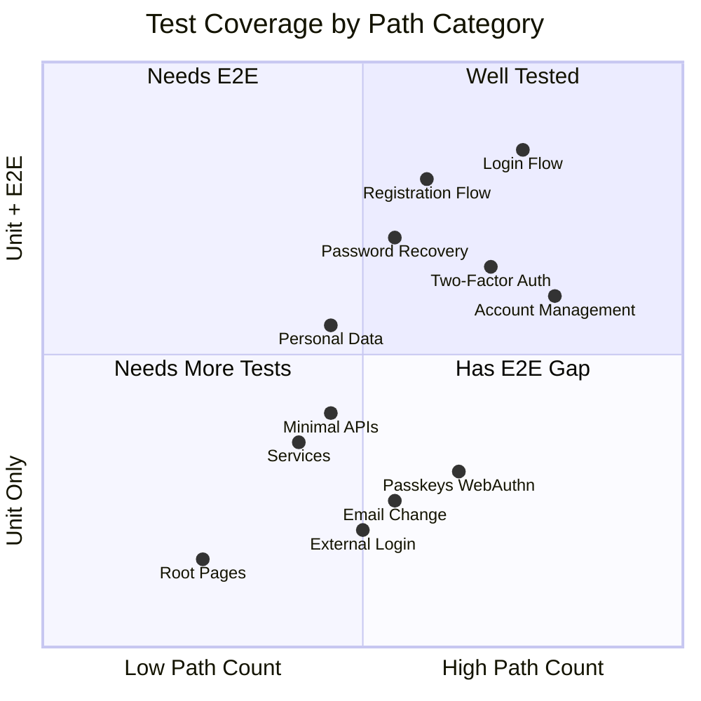

### Path → Test Coverage Table

| Route | GET Unit | POST Unit | E2E | Notes |
|---|---|---|---|---|
| `/Account/Register` | ✅ | ✅ | ✅ | |
| `/Account/RegisterConfirmation` | 🔵 | — | ✅ | Constructor only |
| `/Account/ConfirmEmail` | ✅ | — | ✅ | |
| `/Account/ConfirmEmailChange` | ✅ | — | ❌ | |
| `/Account/ResendEmailConfirmation` | 🔵 | 🔵 | ❌ | Constructor only |
| `/Account/Login` | ✅ | ✅ | ✅ | |
| `/Account/LoginWith2fa` | ✅ | ✅ | ✅ | |
| `/Account/LoginWithRecoveryCode` | ✅ | ✅ | ✅ | |
| `/Account/Lockout` | 🔵 | — | ✅ | Constructor only |
| `/Account/Logout` | — | 🔵 | ❌ | Constructor only |
| `/Account/ForgotPassword` | 🔵 | ✅ | ✅ | |
| `/Account/ForgotPasswordConfirmation` | 🔵 | — | ✅ | Constructor only |
| `/Account/ResetPassword` | ✅ | ✅ | ✅ | |
| `/Account/ResetPasswordConfirmation` | 🔵 | — | ✅ | Constructor only |
| `/Account/ExternalLogin` | ✅ | ✅ | ❌ | No live OIDC in tests |
| `/Account/AccessDenied` | 🔵 | — | ❌ | Constructor only |
| `/Account/Manage/Index` | ✅ | ✅ | ✅ | Via AccountManagementTests |
| `/Account/Manage/Email` | ✅ | ✅ | ❌ | |
| `/Account/ConfirmEmailChange` | ✅ | — | ❌ | |
| `/Account/Manage/ChangePassword` | ✅ | ✅ | ✅ | |
| `/Account/Manage/SetPassword` | ✅ | ✅ | ❌ | |
| `/Account/Manage/TwoFactorAuthentication` | ✅ | — | ✅ | |
| `/Account/Manage/EnableAuthenticator` | ✅ | ✅ | ✅ | |
| `/Account/Manage/ShowRecoveryCodes` | ✅ | — | ✅ | |
| `/Account/Manage/GenerateRecoveryCodes` | ✅ | ✅ | ✅ | |
| `/Account/Manage/Disable2fa` | ✅ | ✅ | ❌ | |
| `/Account/Manage/ResetAuthenticator` | ✅ | ✅ | ❌ | |
| `/Account/Manage/Passkeys` | ✅ | ⚠️ | ❌ | 3 tests Skipped |
| `/Account/Manage/RenamePasskey` | ✅ | ✅ | ❌ | |
| `/Account/Manage/ExternalLogins` | ✅ | ✅ | ❌ | |
| `/Account/Manage/PersonalData` | ✅ | — | ❌ | |
| `/Account/Manage/DownloadPersonalData` | ✅ | — | ❌ | |
| `/Account/Manage/DeletePersonalData` | ✅ | ✅ | ✅ | |
| `POST /Account/PasskeyCreationOptions` | — | ✅ | ❌ | Minimal API |
| `POST /Account/PasskeyRequestOptions` | — | ✅ | ❌ | Minimal API |
| `/Health` | ❌ | — | ❌ | Infrastructure endpoint |
| `/` | 🔵 | — | ❌ | Constructor only |
| `/Privacy` | 🔵 | — | ❌ | Constructor only |
| `/Error` | ✅ | — | ❌ | |

### Coverage Gaps

The following paths have no meaningful behavioral test coverage and are candidates for improvement:

| Gap | Impact | Suggested Test |
|---|---|---|
| WebAuthn browser ceremony (create + sign) | High — core passkey flow untestable | Skip-marked tests in `Passkeys.cshtmlTests.cs` need completion |
| `POST /Account/PasskeyCreationOptions` — antiforgery rejection | Medium | Integration test with missing antiforgery header |
| `POST /Account/PasskeyRequestOptions` — antiforgery rejection | Medium | Integration test with missing antiforgery header |
| `/Account/ExternalLogin` — existing user sign-in success | Medium | Mock `ExternalLoginSignInAsync` success path |
| `/Account/ExternalLogin` — create user failure | Low | Mock `CreateAsync` failure result |
| `GET /Health` | Low | Simple `WebApplicationFactory` integration test |
| `/Account/Logout` — actual sign-out behavior | Low | E2E: verify session cookie cleared |
| `POST /Account/Manage/DownloadPersonalData` — download content | Low | Verify JSON shape and data presence |
| `GET /Account/ResendEmailConfirmation` + `POST` | Low | Unit tests for OnGet/OnPost handlers |
